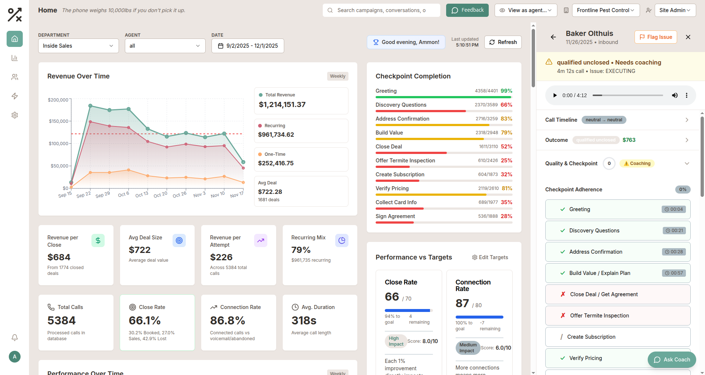
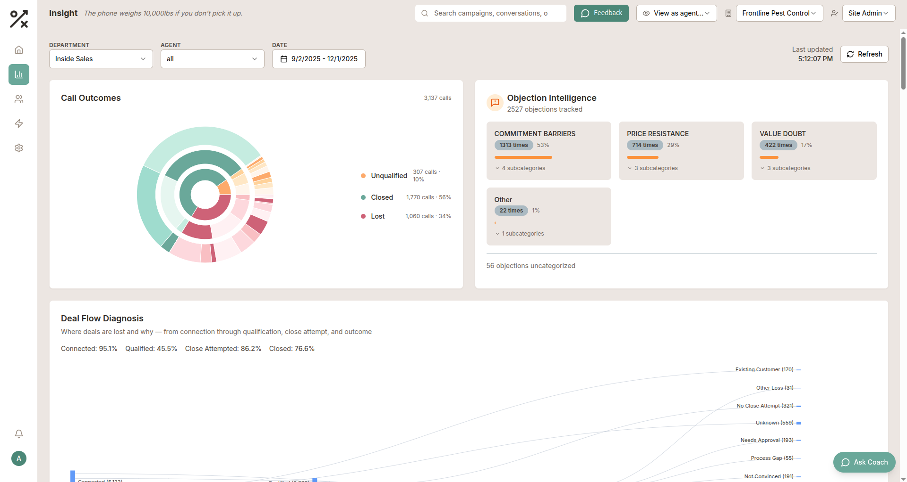
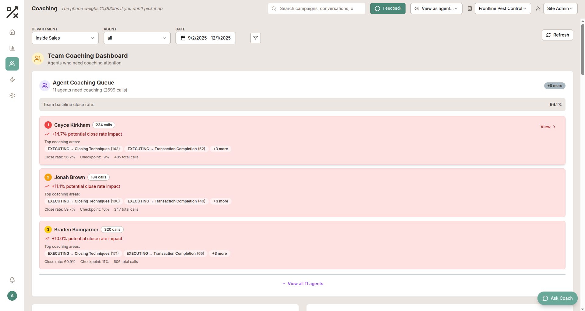
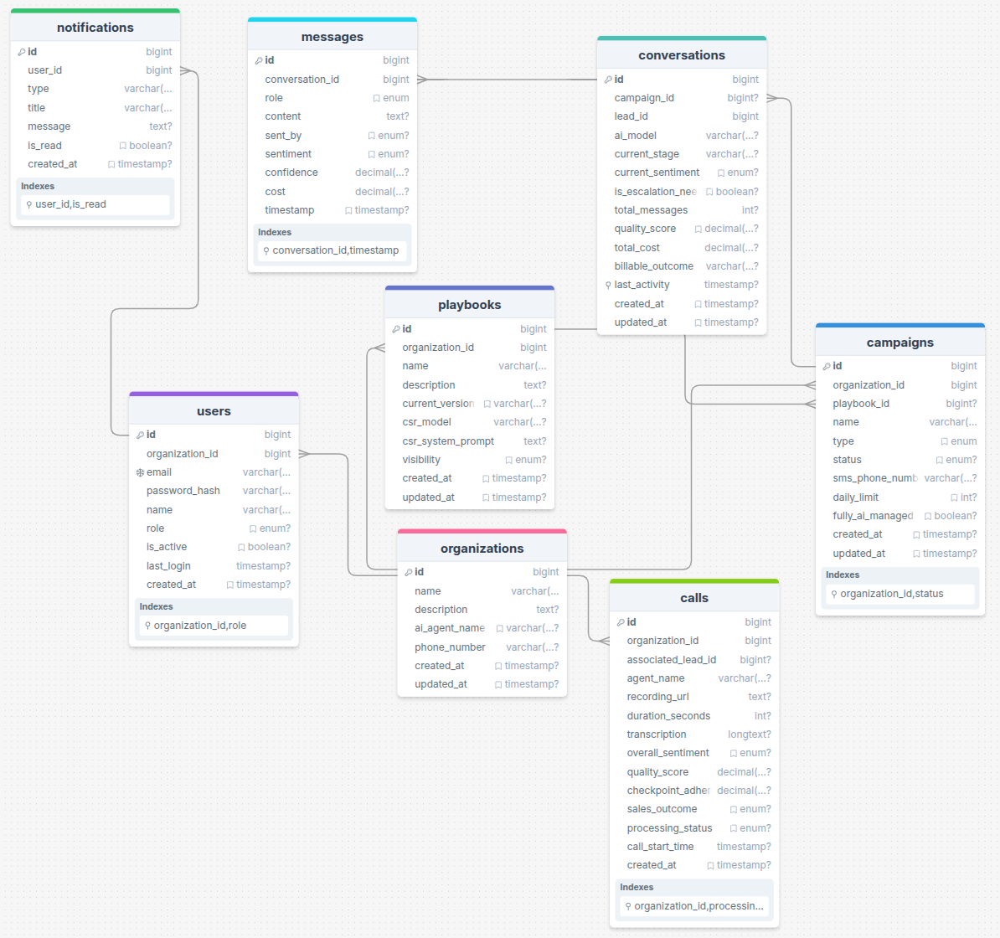

# Plaibook AI Outbound Agent - Final Report

**CS 452 Final Project**
**Author:** Ammon Kunzler
**Date:** December 2024

---

## Project Summary

Plaibook is an AI-powered platform that automates outbound customer engagement through SMS campaigns while giving sales managers real-time oversight through a "Cockpit" interface. The system also ingests call recordings from various softphones (Genesys, Five9, RingCentral), runs them through AI analysis, and surfaces coaching insights to help teams close more deals. Think of it as giving every sales team an AI co-pilot that handles the grunt work while humans focus on the conversations that actually matter.

---

## Demo

**Video Walkthrough:** [Loom Demo](https://www.loom.com/share/8c9be3aaad7743f5aa5d28edd8b8f939)

### Screenshots

**Home Dashboard** - Revenue tracking, checkpoint completion rates, and call detail sidebar with AI-powered quality scoring.



**Insights Dashboard** - Call outcomes visualization, objection intelligence, and deal flow diagnosis.



**Coaching Dashboard** - Agent coaching queue ranked by potential close rate impact.



---

## System Architecture

```
┌─────────────────────────────────────────────────────────────────────────────┐
│                              CLIENT LAYER                                    │
│  ┌─────────────────────────────────────────────────────────────────────┐    │
│  │                    React 19 + TypeScript + Vite                      │    │
│  │  Cockpit │ Campaigns │ Analytics │ Coaching │ Integrations Settings │    │
│  └─────────────────────────────────────────────────────────────────────┘    │
│                    │ tRPC (type-safe)          │ WebSocket                  │
└────────────────────┼───────────────────────────┼────────────────────────────┘
                     ▼                           ▼
┌─────────────────────────────────────────────────────────────────────────────┐
│                              API LAYER (ECS Fargate)                         │
│  ┌──────────────┐  ┌──────────────┐  ┌──────────────┐  ┌──────────────┐     │
│  │  tRPC Router │  │  Socket.IO   │  │   BullMQ     │  │  Schedulers  │     │
│  │  (40+ procs) │  │  (Redis pub) │  │   Queues     │  │  (Cron jobs) │     │
│  └──────────────┘  └──────────────┘  └──────────────┘  └──────────────┘     │
└─────────────────────────────────────────────────────────────────────────────┘
         │                    │                   │
         ▼                    ▼                   ▼
┌─────────────────┐  ┌─────────────────┐  ┌─────────────────────────────────┐
│    MongoDB      │  │     Redis       │  │        AI Services              │
│  (18 collections│  │  (cache, queue, │  │  ┌───────────┐  ┌───────────┐  │
│   replica set)  │  │   socket.io)    │  │  │CSR Agent  │  │ Overseer  │  │
└─────────────────┘  └─────────────────┘  │  └───────────┘  └───────────┘  │
                                          │         OpenRouter API          │
                                          └─────────────────────────────────┘
                                                         │
┌─────────────────────────────────────────────────────────────────────────────┐
│                           AWS LAMBDA (Call Processing)                       │
│  S3 (recordings) → SQS → Lambda → FFmpeg → AI Analysis → MongoDB            │
│                          (0 → 100+ concurrent, auto-scaling)                 │
└─────────────────────────────────────────────────────────────────────────────┘

┌─────────────────────────────────────────────────────────────────────────────┐
│                              INTEGRATIONS                                    │
│    Genesys  │  Five9  │  RingCentral  │  FieldRoutes  │  Surge SMS          │
└─────────────────────────────────────────────────────────────────────────────┘
```

### Entity Relationship Diagram



---

## Key Learnings

### 1. Integration Architecture is Where the Real Complexity Lives

Building the core product features was actually the straightforward part. The real challenge was pulling data from half a dozen different platforms (Genesys, Five9, RingCentral, FieldRoutes) that all have different APIs, auth flows, rate limits, and data formats. I ended up building a "touchpoint model" where the core system is completely agnostic to specific integrations - it just calls generic interfaces and each provider implements the specifics. This meant I could add Five9 support in a day once the pattern was established. The lesson: design for integration from day one, not as an afterthought.

### 2. LLM Data Synthesis Requires Structured Thinking

Getting useful insights out of LLMs isn't just about writing good prompts - it's about structuring your data so the model can actually reason about it. For call analysis, I had to design a schema that captures conversation stages, sentiment shifts, objection handling, and outcome classification in a way that's both machine-parseable and human-readable. The chatbot feature that converts natural language to MongoDB queries was particularly fun: the LLM needs to understand both the user's intent AND the data model to generate valid aggregation pipelines. Caching query results was helpful and fun to learn, as the same insights get requested repeatedly.

### 3. S3 for Blobs, MongoDB for Everything Else

Call recordings didn't fit in my database database. This sounds obvious, but the architecture around it matters. Recordings land in S3, which triggers SQS, which invokes Lambda, which processes with FFmpeg, sends to AI, and writes results back to MongoDB. The recording metadata (duration, size, transcription, AI analysis) lives in Mongo while the actual audio stays in S3. This separation means I can query and filter calls without touching blob storage, and the Lambda function can scale to 100+ concurrent executions without worrying about database connection pooling. The key insight: let each storage system do what it's good at.

### 4. Collaboration on a Codebase Requires Discipline

This project grew out of a startup codebase with multiple contributors. I handled the first ~115k lines of code, but once we onboarded Tanner, Max, and Ivan, code reviews, PRs, and maintaining a clean git history became essential - not just for the team, but for my own sanity when debugging production issues at 2am. The Turborepo setup with separate packages for web, api, and shared types forced good boundaries. Type safety via tRPC meant that when I changed an API, the frontend would refuse to compile until I fixed all the call sites. I'm still working on using less `any`s though, they're easy to add but kill the benefit of tRPC in the first place. That's another story though.

### 5. Real-time Systems Need Redis

Socket.IO works great on a single server. The moment we scaled to multiple ECS instances, everything breaks unless you have Redis coordinating between them. The Redis adapter for Socket.IO handles cross-instance pub/sub so that when a conversation updates on server A, clients connected to server B still get the message. BullMQ uses Redis for job queues, which means jobs persist across deploys and server restarts. Redis went from "nice to have" to "can't function without it" pretty fast. (Unfortunately, this made our AWS bill go up and up lol. Luckily revenue is paying for it for now)

---

## AI Integration

AI is deeply woven into the product, which was one of my goals from the start:

**CSR Agent** - Handles customer conversations following configurable "playbooks." The agent receives conversation history, customer context from integrations (like service history from FieldRoutes), and generates contextually appropriate responses. Temperature settings, model selection, and tool use are all configurable per organization.

**Overseer Agent** - A meta-level AI that reviews conversations for quality, detects escalation needs, tracks sentiment, and scores playbook adherence. This is the "manager looking over your shoulder" for the AI.

**Call Analysis Pipeline** - Lambda functions process call recordings through FFmpeg (audio conversion), then send to Gemini 2.5 Flash for transcription and comprehensive analysis. The AI extracts conversation stages, objections raised, outcomes, and generates coaching recommendations.

**Natural Language Chatbot** - Managers can ask questions like "show me calls from last week where the customer mentioned price concerns" and the system converts that to MongoDB aggregation pipelines. Results are cached to avoid re-running expensive LLM calls.

**AI-Assisted Playbook Creation** - The system can generate conversation playbooks from examples, create test personas, and simulate conversations to evaluate playbook effectiveness before going live.

---

## How AI Assisted in Building This Project

Claude (via Claude Code) was instrumental throughout development:

- **Architecture decisions**: Talked through the integration pattern design and helped validate the touchpoint model approach
- **Code generation**: Generated boilerplate for new tRPC procedures, Mongoose models, and React components
- **Debugging**: Helped trace issues through the Lambda → SQS → MongoDB pipeline when calls weren't processing
- **Refactoring**: Assisted with the Turborepo migration and feature-based code organization
- **Documentation**: Generated much of the technical documentation and this report

The workflow became: think through the problem, discuss with Claude, implement, review, iterate. Having an AI pair programmer that never gets tired and has seen every codebase pattern imaginable honestly made this possible, it would have taken much much longer without it.

---

## Why This Project Interests Me

I'm building a startup in Sandbox (Plaibook), and this is the product. It's not a class project I'll abandon after the semester - it's something we're actively shipping to real customers. The pressure of real users finding bugs with real money on the line makes you think differently about architecture, error handling, and observability. (Or, maybe it didn't make me _think_ differently about it, but it certainly made me _rethink_ it when things started breaking down)

The intersection of AI and sales automation has been super juicy to work with. Sales teams generate massive amounts of data (calls, emails, texts) that historically just sat in storage. Now we can actually learn from it, coach from it, and use it to make the next conversation better. It feels like we're at the beginning of a major shift in how knowledge work gets done.

Also, there's something deeply satisfying about building systems that scale. Watching Lambda spin up 50 concurrent executions to chew through a backlog of call recordings, or seeing Redis coordinate real-time updates across multiple servers - that's the kind of engineering that makes me want to keep building.

---

## Technical Deep-Dive

### Scaling Characteristics

| Component | Strategy | Notes |
|-----------|----------|-------|
| API (ECS Fargate) | Horizontal scaling (2+ instances) | ALB distributes traffic, Redis coordinates state |
| Lambda | Instant scaling (0 → 100+ concurrent) | Perfect for bursty call processing workloads |
| MongoDB | Replica set with read replicas | Writes go to primary, analytics queries hit secondaries |
| Redis | ElastiCache cluster | Handles Socket.IO pub/sub, BullMQ queues, session cache |
| Socket.IO | Redis adapter | Cross-instance real-time communication |

### Concurrency Handling

- **Atomic MongoDB operations**: All updates use `$set`, `$push`, `$inc` operators - no read-modify-write cycles
- **Queue isolation**: Separate BullMQ queues for different job types prevent one slow operation from blocking others
- **Optimistic patterns**: Turn analysis uses append-only writes, conversation updates are idempotent
- **Rate limiting**: 5000 requests per 15 minutes per client via Express middleware

### Failover Strategy

- **ECS multi-AZ**: Instances run across availability zones, ALB health checks route around failures
- **MongoDB replica set**: Automatic primary election if a node fails
- **Dead letter queues**: Failed jobs go to DLQ for manual inspection and replay
- **Graceful shutdown**: SIGTERM handlers close connections cleanly, drain in-flight requests
- **Redis persistence**: RDB snapshots for recovery (job queue state survives restarts)

### Authentication & Security

- **JWT tokens**: 7-day access tokens, long-lived refresh tokens (though we're not rotating our backend token like we should, it's just hardcoded in an .env)
- **Helmet.js**: Security headers (HSTS, CSP, X-Frame-Options)
- **CORS**: Origin validation against allowed frontend URLs
- **Secrets management**: AWS Secrets Manager for production credentials
- **Input validation**: Zod schemas on every tRPC procedure
- **Non-root containers**: Docker runs as user 1001

---

## Progress Log
> Truncated to the the database heavy sides of this, and only since the final project was introduced in class

| Date | Work Completed | Estimated Hours |
|------|----------------|-------|
| 11/3/2025 | Genesys integration to download call recordings and data | 3 |
| 11/4/2025 | Vector clustering for smarter categories | 4 |
| 11/5/2025 | Revamped Genesys integration: auto fetching, user management | 6 |
| 11/6/2025 | Call feedback bugfixing, processing prompt refinement | 2 |
| 11/8/2025 | Debugged call handling across different orgs | 1 |
| 11/14/2025 | Built natural language to MongoDB chatbot | 6 |
| 11/15/2025 | Refining chatbot | 2 |
| 11/17/2025 | Refactor project into TurboRepo and Tanstack tables | 4 |
| 11/18/2025 | Refactor components into vertical/feature organization | 2 |
| 11/19/2025 | Organized data aggregation into pages, added charts | 5 |
| 11/20/2025 | Isolated call processing to Lambda, refined admin settings | 4 |
| 11/22/2025 | Lambda call processing | 2 |
| 11/26/2025 | Multi-tenant definition of checkpoints, prompt injection | 2 |
| 11/27/2025 | Simplified clustering into pre-defined hierarchies | 3 |
| 11/29/2025 | UI overhaul after pulling more data from each call | 4 |
| 12/1/2025 | New charts, refined organization | 3 |
| 12/3/2025 | Integrating into a few other softphones | 4 |
| **Total** | | **57** |

---

## Links

- **Demo Video:** [Loom Walkthrough](https://www.loom.com/share/8c9be3aaad7743f5aa5d28edd8b8f939)
- **Class Channel Post:** [Teams Post](https://teams.microsoft.com/l/message/19:aa68ccc0d80e460bb785b2b9085c26ba@thread.tacv2/1765080686132?tenantId=c6fc6e9b-51fb-48a8-b779-9ee564b40413&groupId=null&parentMessageId=1765080686132&teamName=CS%20452%20001%20(Fall%202025)&channelName=Report%20-%20Final%20Project&createdTime=1765080686132)

---

## Sharing Permission

**No, don't share** - This is a startup product with proprietary code. Happy to discuss the architecture and learnings, but the repo itself stays private.

---

## Technology Stack Summary

| Layer | Technology |
|-------|------------|
| Frontend | React 19, Vite, TypeScript, Tailwind CSS, Zustand, React Query |
| API | Node.js, Express, tRPC, Socket.IO |
| Database | MongoDB (Mongoose ODM) |
| Cache/Queue | Redis (ElastiCache), BullMQ |
| AI | OpenRouter (Claude, GPT-4, Gemini) |
| Infrastructure | AWS ECS Fargate, Lambda, S3, SQS, ALB |
| IaC | Terraform |
| Monitoring | Datadog APM, CloudWatch |
| Build | Turborepo monorepo |
