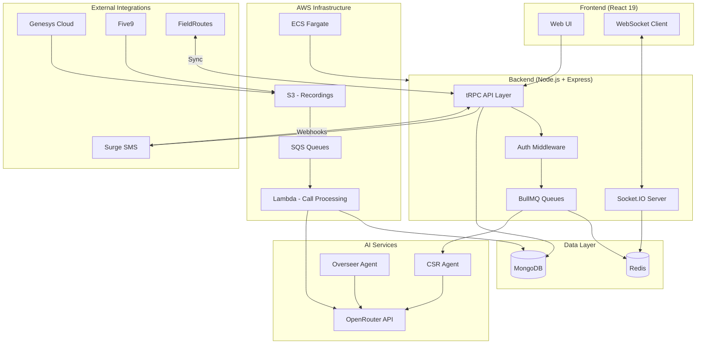

# Plaibook - AI Outbound Agent
## CS 452 Final Project - Initial Design

**Author:** Ammon Kunzler
**Date:** December 2024
**Repository:** [GitHub Link - TBD]

---

## Project Summary

**Plaibook** is an AI-powered outbound messaging and conversation management platform that automates customer engagement through SMS campaigns while providing real-time human oversight via a "Cockpit" interface.

> **One-liner:** An AI agent that handles outbound SMS campaigns with intelligent conversation management, call analytics, and coaching insights.

### Why This Project?

This project combines several interests:
- **AI/LLM Integration** - Building practical applications with Claude, GPT-4, and other models
- **Real-time Systems** - WebSocket-based live conversation management
- **Data Engineering** - Processing call recordings, transcriptions, and analytics at scale
- **Production Architecture** - Multi-tenant SaaS with proper security, scaling, and observability

---

## Problem Statement

**Sales and customer service teams face a scaling problem:**

1. **Manual Outreach Doesn't Scale** - Humans can only handle so many conversations simultaneously
2. **Quality Varies** - Without consistent playbooks, conversation quality depends on individual skill
3. **No Visibility** - Managers can't monitor conversations in real-time or coach effectively
4. **Call Analytics Gap** - Call recordings sit unused without AI-powered analysis
5. **Integration Complexity** - Connecting to CRMs, dialers, and scheduling systems is painful

**Plaibook solves this by:**
- Automating outbound SMS with AI agents that follow configurable "playbooks"
- Providing a real-time Cockpit for human oversight and intervention
- Analyzing call recordings with AI for quality scoring and coaching
- Integrating with field service (FieldRoutes), contact centers (Genesys, Five9), and more

---

## Core Features

### 1. AI-Powered Conversations
- **CSR Agent** - Handles customer conversations following playbook scripts
- **Overseer Agent** - Reviews AI responses for quality and compliance
- **Intelligent Escalation** - Automatically flags conversations needing human review

### 2. Campaign Management
- Create inbound/outbound campaigns with custom funnel stages
- Import leads from CSV, API, or integrations
- Configure business hours, pacing, and follow-up schedules

### 3. Real-time Cockpit
- Kanban board showing all active conversations
- Live message streaming via WebSocket
- One-click human takeover of AI conversations

### 4. Call Analytics & Coaching
- Import call recordings from Genesys, Five9, RingCentral
- AI transcription and analysis
- Quality scoring with checkpoint adherence
- AI coaching chatbot for managers

### 5. Integrations
- **FieldRoutes** - Field service scheduling and routing
- **Genesys/Five9/RingCentral** - Call center platforms
- **Surge SMS** - Message delivery
- **SignWell** - Electronic signatures

---

## Entity Relationship Diagram


### Core Tables (10)

| Table | Purpose | Key Relationships |
|-------|---------|-------------------|
| **organizations** | Multi-tenant container | Parent of users, campaigns, leads, playbooks, calls |
| **users** | Authentication & RBAC | Belongs to organization, receives notifications |
| **playbooks** | AI conversation scripts | Belongs to organization, used by campaigns |
| **campaigns** | Outbound/inbound campaigns | Uses playbook, contains leads & conversations |
| **leads** | Customer contacts | Belongs to organization & campaign, has conversations |
| **conversations** | Message threads | Links campaign to lead, contains messages |
| **messages** | Individual SMS/AI messages | Belongs to conversation |
| **calls** | Call recordings & analysis | Belongs to organization, linked to lead |
| **integrations** | External service configs | Belongs to organization (Genesys, FieldRoutes, etc.) |
| **notifications** | User alerts | Belongs to user |

---

## System Architecture



---

## Technology Stack

| Layer | Technology | Purpose |
|-------|------------|---------|
| **Frontend** | React 19, Vite, TypeScript | Single-page application |
| **Styling** | Tailwind CSS | Utility-first CSS |
| **State** | Zustand, React Query | Client & server state |
| **API** | tRPC v11 | End-to-end type safety |
| **Backend** | Node.js, Express | API server |
| **Database** | MongoDB 8.x | Document storage |
| **Cache/Queue** | Redis, BullMQ | Caching & job queues |
| **Real-time** | Socket.IO | WebSocket communication |
| **AI** | OpenRouter (Claude, GPT-4) | LLM inference |
| **Cloud** | AWS (ECS, Lambda, S3, SQS) | Infrastructure |
| **IaC** | Terraform | Infrastructure as code |
| **Monitoring** | Datadog | APM & logging |

---

## Data Flow Examples

### Inbound SMS Flow
```
Customer sends SMS
    → Surge webhook received
    → Message queued (BullMQ)
    → Conversation created/updated (MongoDB)
    → CSR Agent generates response (OpenRouter)
    → Overseer Agent reviews (OpenRouter)
    → Message queued for delivery
    → Surge API sends SMS
    → WebSocket notifies Cockpit UI
```

### Call Processing Flow
```
Call recording uploaded to S3
    → SQS triggers Lambda
    → Lambda downloads & converts audio (FFmpeg)
    → AI transcription (Whisper)
    → AI analysis (Gemini/Claude)
    → Results stored (MongoDB)
    → WebSocket notifies UI
```

---

## Scaling Characteristics

| Component | Scaling Strategy | Bottleneck |
|-----------|------------------|------------|
| **API (ECS)** | Horizontal (0-10 instances) | CPU/Memory |
| **Lambda** | Instant (0-1000 concurrent) | Account limits |
| **MongoDB** | Replica set, sharding | Write throughput |
| **Redis** | Cluster mode | Memory |
| **Socket.IO** | Redis adapter for multi-node | Connection count |

### Concurrency Considerations
- **Atomic Updates** - MongoDB `$set`, `$push` operators prevent race conditions
- **Optimistic Locking** - Turn analysis uses append-only pattern
- **Queue Isolation** - Separate queues for different job types
- **Rate Limiting** - 5000 req/15min per client

---

## UI Screenshots

### Home Dashboard
Revenue tracking, checkpoint completion rates, and call detail sidebar with AI-powered quality scoring.


### Insights Dashboard
Call outcomes visualization, objection intelligence tracking, and deal flow diagnosis.


### Coaching Dashboard
Agent coaching queue ranked by potential close rate impact, with coaching areas and performance metrics.


---

## Initial Goals / Timeline

> **Note:** These are rough targets for iterative progress, not strict deadlines.

### Week 1 (Current)
- [x] Initial design document
- [x] MySQL DDL schema design
- [ ] Set up public GitHub repository
- [ ] Document existing architecture

### Week 2
- [ ] Add progress logging infrastructure
- [ ] Implement any missing CRUD operations
- [ ] Write integration tests for core flows

### Week 3
- [ ] Performance testing (target: 100 concurrent conversations)
- [ ] Implement caching layer optimizations
- [ ] Add monitoring dashboards

### Week 4 (Final)
- [ ] Final presentation preparation
- [ ] Demo video recording
- [ ] Final report write-up
- [ ] Code cleanup and documentation

---

## Assignment Checklist

| Requirement | Status | Notes |
|-------------|--------|-------|
| Reads and writes to data | ✅ | MongoDB for persistence, Redis for caching |
| Interesting to me | ✅ | AI agents, real-time systems, production architecture |
| 30-40 hours effort | ✅ | Ongoing development over several months |
| Resume-worthy | ✅ | Production SaaS with multiple integrations |
| Security considerations | ✅ | JWT auth, RBAC, encrypted credentials |
| Concurrency handling | ✅ | Atomic operators, queue isolation |
| Failover strategy | 🟡 | ECS multi-AZ, MongoDB replica set (needs documentation) |

---

## Files in This Repository

```
ammon-cs452/
├── INITIAL_DESIGN.md    # This document
├── schema.sql           # MySQL DDL representation of data model
├── PROGRESS_LOG.md      # Time tracking (to be created)
├── FINAL_REPORT.md      # Final project report (to be created)
└── screenshots/         # UI screenshots (to be added)
```

---

## Questions / Feedback Welcome

This is a living document. As the project progresses, I'll update the design based on learnings and feedback.
